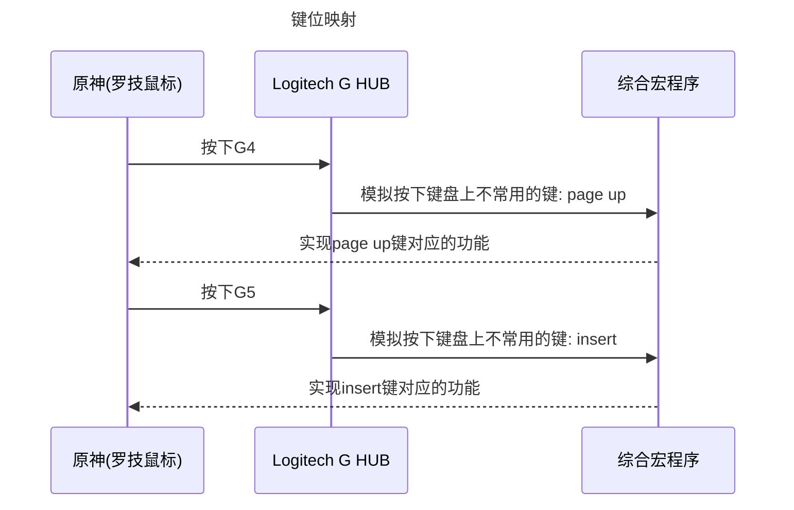

# 前言

> 1. 4k、2k、1080p及以下`（宽:高 = 16:9）`的游戏分辨率：理论上来说，传送宏、半自动钓鱼、自动挑狗粮和聊天检测等功能无需自行配置参数，即可正常运行。
> 2. 也支持其它任何非`16:9`的游戏分辨率，但是得自行配置文件`（一些坐标和几张图）`后，程序才能打开预期的效果。
> 3. 作者：干饭带我一个i（B站同名）。
> 4. QQ群：493727973。
> 5. 版本号：2.5.0(2023-12-19)。


[TOC]

## [是否开启]

1. 所有ini配置文件内的<是否开启>参数说明：

   ```python
   是否开启 = xxx
   ```

2. 是否开启的取值分两种：

   - True：开启；
   - False：关闭。

3. 示例（参考<<是否开启字典>>，忽略英文字母大小写）

   - 您想> 开启`True`：

     ```python
     是否开启 = True
     是否开启 = true
     是否开启 = TRUE
     是否开启 = t
     是否开启 = T
     是否开启 = yes
     是否开启 = s
     是否开启 = 1
     是否开启 = 是
     是否开启 = 开启
     ...
     ```

   - 您想> 关闭`False`：

     ```python
     是否开启 = False
     是否开启 = false
     是否开启 = FALSE
     是否开启 = f
     是否开启 = F
     是否开启 = no
     是否开启 = n
     是否开启 = 0
     是否开启 = 关闭
     ...
     ```

**<u>*<是否开启字典>*</u>**

```python
{"true": True, "t": True, "yes": True, "y": True, "是": True, "s": True, "1": True, "ture": True, "开启": True, 
"false": False, "f": False, "no": False, "n": False, "否": False, "0": False, "关闭": False}
```


## [触发按钮]

1. 所有ini配置文件内的<触发按钮>参数说明：

   ```python
   触发按钮 = ['xxx']
   ```

2. `'xxx'`从<<键值>>中选取即可，注意：

   - **不能忽略字母大小写**！！！

   - 在`[]`之间填入自己需要的键值，可以填1个或多个键值，用英文`,`分隔开即可；

   - 示例：

     - `page down`键触发：

       ```python
       触发按钮 = ['page down']
       ```

     - `c`，`C`和`tab`键触发：

       ```python
       触发按钮 = ['c', 'C', 'tab']
       ```

     - `+`，`~`键触发：

       ```python
       触发按钮 = ['+', '~']
       ```

**<u>*<键值>*</u>**

```python
['a', 'alt', 'b', 'backspace', 'c', 'caps lock', 'clear', 'ctrl', 'd', 'decimal', 'delete', 'down', 
'e', 'end', 'enter', 'esc', 'f', 'f1', 'f2', 'f3', 'f4', 'f5', 'f6', 'f7', 'f8', 'f9', 'f10', 'f11', 'f12', 
'g', 'h', 'home', 'i', 'insert', 'j', 'k', 'l', 'left', 'left windows', 'm', 'menu', 'n', 'num lock', 'o', 
'p', 'page down', 'page up', 'pause', 'print screen', 'q', 'r', 'right', 'right alt', 'right ctrl', 'right shift', 
's', 'scroll lock', 'shift', 'space', 't', 'tab', 'u', 'up', 'v', 'w', 'x', 'y', 'z', 
'A', 'B', 'C', 'D', 'E', 'F', 'G', 'H', 'I', 'J', 'K', 'L', 'M', 'N', 'O', 'P', 'Q', 'R', 'S', 'T', 'U', 'V', 'W', 'X', 'Y','Z', 
'0', '1', '2', '3', '4', '5', '6', '7', '8', '9', ':', ';', '<', '=', '>', '?', '@', 
'!', '"', '#', '$', '%%', '&', "'", '(', ')', '*', '+', ',', '-', '.', '/', 
'[', '\\', ']', '^', '_', '`', '{', '|', '}', '~']
```


## [触发方式]

1. 所有ini配置文件内的<触发方式>参数说明：

   ```python
   触发方式 = xxx
   ```

2. 触发方式的取值分两种：

   - True：按住生效，松开结束；
   - False：默认方式，即按一次（包括按下和松开）开始生效，再按一次（包括按下和松开）结束。

3. 示例（参考<<触发方式字典>>，忽略英文字母大小写）

   - 您想> 按住生效`True`：

     ```python
     触发方式 = True
     触发方式 = true
     触发方式 = TRUE
     触发方式 = 按住
     触发方式 = 按住生效
     触发方式 = pressed
     ...
     ```

   - 您想> 默认方式`False`：

     ```python
     触发方式 = False
     触发方式 = false
     触发方式 = FALSE
     触发方式 = 默认
     触发方式 = 触发
     触发方式 = default
     ...
     ```

**<u>*<触发方式字典>*</u>**

```python
{"默认": False, "触发": False, "false": False, "default": False, 
 "按住": True, "按住生效": True, "pressed": True, "true": True}
```


## [获取坐标]

- [x] 系统自带。用windows画图打开地图，即可查看坐标。

- [x] 微信自带。默认快捷键`Alt+A`可触发截屏，在鼠标附件会实时显示坐标。

- [x] 其它实用工具。如`Snipaste`和`PixPin`等截图软件，使用方法同微信。

- [x] 本程序自带。在命令框（程序最下方，如若没显示，按快捷键`Ctrl+D`呼出命令框）中输入指定命令：<u>**`start record`**</u>后触发。根据程序提示信息进行录制坐标操作，录制结束后自动输出带格式的坐标集合，同时粘贴到系统剪切板。

  ```python
  [2023-12-19 16:59:03.39] _______________________________________
  [2023-12-19 16:59:03.43] 请按{'f9': True}开始/停止录制
  [2023-12-19 16:59:03.46] 输入 'stop record' 敲回车退出录制模式
  
  || 开始录制: 
  || 录制结束, 您按下的位置如下 (已自动复制到剪切板): 
  [(566, 574), (922, 502), (1140, 623), (1521, 575), (1224, 375), (1035, 456), (1138, 783), (1397, 727), (1333, 469)]
  
  
  [2023-12-19 16:59:17.75] 已退出录制模式
  [2023-12-19 16:59:17.78] _______________________________________
  
  ```


## [全部命令]

> 在程序窗口内按`Ctrl`+`H`或敲`help`查看目前版本支持的全部快捷命令
>
> 常用命令：`cls`，`menu`，`reconfig`，`swap1`...

```python
[2023-12-19 21:53:05.69] Clear Screen..
[help] 请输入对应命令敲回车, 触发对应操作	
╒════╤═════════════════════╤═══════════════════════════╤════════════════════════════════════════════════════════════════╕
│    │ 命令                │ 命令说明                  │ 命令含义                                                                   
╞════╪═════════════════════╪═══════════════════════════╪════════════════════════════════════════════════════════════════╡
│  0 │ cls                 │ Clear Screen              │ 清空窗口输出的信息                                                         
├────┼─────────────────────┼───────────────────────────┼────────────────────────────────────────────────────────────────┤
│  1 │ menu                │ Print Menu                │ 打印综合宏菜单                                                             
├────┼─────────────────────┼───────────────────────────┼────────────────────────────────────────────────────────────────┤
│  2 │ reconfig            │ Read .ini                 │ 尝试重新读取所有.ini                                                       
├────┼─────────────────────┼───────────────────────────┼─────────────────────────────────────────────────────────────────┤
│  3 │ start record        │ Recording Click(x, y)     │ 录制鼠标点击的坐标, 并自动复制到剪切板                                         
├────┼─────────────────────┼───────────────────────────┼────────────────────────────────────────────────────────────────┤
│  4 │ stop record         │ Stop Recording            │ 退出 [录制模式]                                                           
├────┼─────────────────────┼───────────────────────────┼────────────────────────────────────────────────────────────────┤
│  5 │ swap1               │ Swap Trigger Key          │ 交换 [龙王转圈] 和 [连点] 的触发键                                           
├────┼─────────────────────┼───────────────────────────┼────────────────────────────────────────────────────────────────┤
│  6 │ swap2               │ Swap Trigger Key          │ 交换 [龙王转圈] 和 (diy.ini内功能名称里第一次出现关键词'ch')[...ch...] 的触发键 │
├────┼─────────────────────┼───────────────────────────┼────────────────────────────────────────────────────────────────┤
│  7 │ keyname             │ Query KeyName             │ 自动输出按键名称, 按'esc'退出                                               
│    │                     │                           │ ※ 修改.ini内触发按钮时可参考                                       
├────┼─────────────────────┼───────────────────────────┼────────────────────────────────────────────────────────────────┤
│  8 │ count               │ Calculator                │ 作者自用, 计算每日进度的命令, 请无视.                                         
├────┼─────────────────────┼───────────────────────────┼────────────────────────────────────────────────────────────────┤
│  9 │ 自启拾取            │ Enable Autostart1         │ 开启传送后自启 [自动拾取]                                                     
├────┼─────────────────────┼───────────────────────────┼────────────────────────────────────────────────────────────────┤
│ 10 │ 自启狗粮            │ Enable Autostart2         │ 开启传送后自启 [自动挑狗粮]                                                   
├────┼─────────────────────┼───────────────────────────┼─────────────────────────────────────────────────────────────────┤
│ 11 │ 关闭自启            │ Disable Autostart         │ 关闭传送后自启 [自动拾取] 和 [自动挑狗粮]                                       
├────┼─────────────────────┼───────────────────────────┼─────────────────────────────────────────────────────────────────┤
│ 12 │ info                │ Output Window Information │ 输出活动窗口名称, 位置, 分辨率和系统缩放                                       
├────┼─────────────────────┼───────────────────────────┼─────────────────────────────────────────────────────────────────┤
│ 13 │ diy reconfig        │ Initialize_01             │ 单独重新加载 ./ini/1_自定义[sep].ini                                       
├────┼─────────────────────┼───────────────────────────┼──────────────────────────────────────────────────────────────────┤
│ 14 │ fish reconfig       │ Initialize_02             │ 单独重新加载 ./ini/2_半自动钓鱼[sep].ini                                     
├────┼─────────────────────┼───────────────────────────┼──────────────────────────────────────────────────────────────────┤
│ 15 │ pick reconfig       │ Initialize_03             │ 单独重新加载 ./ini/3_自动拾取_自动挑狗粮[sep].ini                             
├────┼─────────────────────┼───────────────────────────┼──────────────────────────────────────────────────────────────────┤
│ 16 │ transmit reconfig   │ Initialize_04             │ 单独重新加载 ./ini/4_传送宏[sep].ini                                       
├────┼─────────────────────┼───────────────────────────┼──────────────────────────────────────────────────────────────────┤
│ 17 │ medicine reconfig   │ Initialize_05             │ 单独重新加载 ./ini/5_一键吃药[sep].ini                                     
├────┼─────────────────────┼───────────────────────────┼──────────────────────────────────────────────────────────────────┤
│ 18 │ liandian reconfig   │ Initialize_06             │ 单独重新加载 ./ini/6_一键连点[sep].ini                                     
├────┼─────────────────────┼───────────────────────────┼──────────────────────────────────────────────────────────────────┤
│ 19 │ nawei reconfig      │ Initialize_07             │ 单独重新加载 ./ini/7_龙王秒蓄转圈[sep].ini                                   
├────┼─────────────────────┼───────────────────────────┼──────────────────────────────────────────────────────────────────┤
│ 20 │ click loop reconfig │ Initialize_08             │ 单独重新加载 ./ini/8_循环点击[sep].ini                                     
├────┼─────────────────────┼───────────────────────────┼───────────────────────────────────────────────────────────────────┤
│ 21 │ click seq reconfig  │ Initialize_09             │ 单独重新加载 ./ini/9_依次点击[sep].ini                                     
├────┼─────────────────────┼───────────────────────────┼────────────────────────────────────────────────────────────────────┤
│ 22 │ chat reconfig       │ Initialize_10             │ 单独重新加载 ./ini/10_游戏内聊天优化[sep].ini                               
╘════╧═════════════════════╧═══════════════════════════╧═══════════════════════════════════════════════════════════════════╛
[2023-12-19 21:53:07.33] Help
```


## [联合罗技]




# A. 交互界面[sep]

|  编号   | 参数                           | 含义                                      |
| :-----: | :----------------------------- | ----------------------------------------- |
| No.0000 | `size = (627, 808)`            | 初始窗口的大小：宽=627，长=808            |
| No.0001 | `position = (348, 62)`         | 初始窗口的位置：x=348，y=62               |
| No.0002 | `is_topmost = False`           | 取消置顶                                  |
| No.0003 | `is_frameless = False`         | 取消无边框（窗口化）                      |
| No.0004 | `theme = simplex`              | 主题设为`simplex`                         |
| No.0005 | `alpha = 1.0`                  | 窗口透明度设为`1.0`                       |
| No.0006 | `font_type = Consolas`         | 初始字体设为`Consolas`                    |
| No.0007 | `font_size = 10`               | 初始字号设为`10`                          |
| No.0008 | `is_wrap = False`              | 取消窗口内文字自动换行                    |
| No.0009 | `is_hidden_command = False`    | 取消隐藏命令输入框                        |
| No.0010 | `print_details_status = False` | 取消初始加载ini配置文件时输出参数细节信息 |


# B. 首选项

|  编号   | 参数                                                         | 含义                                                         |
| :-----: | :----------------------------------------------------------- | :----------------------------------------------------------- |
| No.0021 | `终止程序按钮 = ['f10']`                                     | 按`f10`退出程序                                              |
| No.0022 | `状态提示置顶窗口是否打开 = True`                            | 启用置顶提示窗口`ON/0/0`                                     |
| No.0023 | `是否启用_手动配置窗口 = True`                               | 启用手动配置窗口信息（固定化）                               |
| No.0024 | `手动配置窗口_标题 = ["原神", "云·原神"]`                    | 窗口标题名称                                                 |
| No.0025 | `手动配置窗口_左上角坐标 = (0, 0)`                           | 窗口左上角位置（坐标：`x`, `y`）                             |
| No.0026 | `手动配置窗口_分辨率 = (1920, 1080)`                         | 窗口分辨率（大小：宽，高）                                   |
| No.0027 | `自动搜索窗口_标题 = ["原神", "YuanShen"]`                   | ***自动搜索窗口所需关键词***                                 |
| No.0028 | `自动搜索窗口_标题最多字符数量 = 10`                         | ***限定匹配窗口的标题长度***                                 |
|         |                                                              |                                                              |
| No.0031 | `手动管理按钮 = ['f9']`                                      | 手动按`f9`切换`ON`或`OFF`状态                                |
| No.0032 | `是否需要自动管理 = True`                                    | 开启某些场景切换后，***自动状态切换***                       |
|         |                                                              |                                                              |
| No.0041 | `是否需要 = True`                                            | 开启`功能辅助关闭`                                           |
| No.0042 | `触发按钮 = ['enter', 'esc', 'tab', 'left windows', `<br />                                 ` 'f1', 'f2', 'f3', 'f4', 'f5', `<br />      `'b', 'B', 'c', 'C', 'l', 'L', 'm', 'M', 'o', 'O']` | 触发`b:背包，m:地图，tab:切屏，...`等键后，<br />程序自动将目前正在运行的功能关闭。 |

```python
>> 终止程序按钮: f10
[2023-12-19 17:14:55.98] [INFO] 当前系统缩放为: 100%
>>> 手动设置窗口信息...
>>  窗口名称: 原神, 云·原神
>>  窗口左上角坐标: (0, 0)
>>  窗口分辨率: (1920, 1080)
>>> 手动设置成功.

>> 自动管理程序开关 已开启: 
   手动管理键: f9
>> 功能辅助关闭 已开启: 
   游戏内触发以下任何键后自动关闭已开启的功能 = 
	dict_keys(['enter', 'esc', 'tab', 'left windows', 'f1', 'f2', 'f3', 'f4', 'f5', 'b', 'B', 'c', 'C', 'l', 'L', 'm', 'M', 'o', 'O'])
[2023-12-19 17:14:56.22] [INFO]: 配置文件"./ini/0_首选项.ini"加载完毕!

>> 终止程序按钮: f10
[2023-12-19 22:24:46.44] [INFO] 当前系统缩放为: 100%
>> 开始搜索名称含有关键词 (原神, YuanShen)的窗口:
   (窗口名称的长度限定在10字符内)
+------+----------+----------+------------+
| 选项 | 窗口名称 | 窗口位置 | 窗口分辨率 |
+------+----------+----------+------------+
|  1   |   原神   |  (0, 0)  | 1920x1080  |
+------+----------+----------+------------+
PS< 选项只有1个, 自动选定..

>> 自动管理程序开关 已开启: 
   手动管理键: f9
>> 功能辅助关闭 已开启: 
   游戏内触发以下任何键后自动关闭已开启的功能 = 
	dict_keys(['enter', 'esc', 'tab', 'left windows', 'f1', 'f2', 'f3', 'f4', 'f5', 'b', 'B', 'c', 'C', 'l', 'L', 'm', 'M', 'o', 'O'])
[2023-12-19 22:24:46.56] [INFO]: 配置文件"./ini/0_首选项.ini"加载完毕!
```


# 一、自定义[sep]

| 编号    | 参数                                                         | 含义                                                         |
| ------- | ------------------------------------------------------------ | ------------------------------------------------------------ |
| No.0111 | `是否开启 = True`                                            | 开启该自定义功能                                             |
| No.0112 | `功能名称 = xxx`                                             | 设定功能的名称                                               |
| No.0113 | `触发按钮 = ['page down']`                                   | 触发键为`page down`，可参考**<u>*前言*</u>**内说明           |
| No.0114 | `触发方式 = 默认`                                            | 触发方式为`默认`，可参考**<u>*前言*</u>**内说明              |
| No.0115 | `循环执行 = True`                                            | 开启`循环执行`                                               |
| No.0116 | `独立执行 = False`                                           | 取消`独立执行`<br />（独立执行：该功能生效期间，不触发其它宏） |
| No.0117 | `辅助关闭 = True`                                            | 开启`辅助关闭`，可参考**<u>*No.0041*</u>**内说明             |
| No.0118 | `模拟指令集 = [("ml", "down", 0, 0, 1800),  `<br />`("ml", "up", 0, 0, 175),("kb", "r", 1800), `<br />`("ml", 0, 0, 50), ("mr", 0, 0, 200)]` | 定义该功能需要模拟哪些键鼠操作，具体说明见**<u>*No.0119*</u>** |

> 所有`[自定义功能x]`都是这个格式。您可以自行添加自己定义的按键宏，保证新增功能的序号`x=`(该文档最后一个自定义功能的序号)`y+1`即可。
>


**No.0119** 模拟指令集说明：

- [x] `m: mouse, kb: keyboard, t: delay`(单位`ms`), `x(y)`: 横(纵)坐标(非负整数)
- [x] 将鼠标点击`x = 0`, `y = 0`的情况, 视为点击鼠标当前位置
- [x] 请参考如下所示 `12`种 用法:

```ini
模拟按下的keyname(忽略大小写):
	1. 基础键: 0~9, a~z, f1~f12
	2. 符号键: , . / ; [ ] - = `(其它符号与shift组合即可)
	3. 控制键: alt, backspace, ctrl, enter, esc, shift, space, tab, caps lock, left windows(or win), page up, page down, end, home, left, up, right, down, insert, delete, numlock
```

|  No  |                     Example |                            | Explanation                                    |
| :--: | --------------------------: | -------------------------- | :--------------------------------------------- |
|  1   |            `("ml", x, y, t) |                            | 鼠标左击(`left`) 坐标`(x, y)`                  |
|  2   |                             | ``("ml", "down", x, y, t)` | 鼠标左键仅按下                                 |
|  3   |                             | `("ml", "up", x, y, t)`    | 鼠标左键仅松开                                 |
|  4   |           `("mr", x, y, t)` |                            | 鼠标右击(`right`)     坐标`(x, y)`             |
|  5   |                             | `("mr", "down", x, y, t)`  | 鼠标右键仅按下                                 |
|  6   |                             | `("mr", "up", x, y, t)`    | 鼠标右键仅松开                                 |
|  7   |              `("mw", n, t)` |                            | 鼠标滚轮(`wheel`)	滚动距离`n`(正负代表上下) |
|  8   |         `("cp", "text", t)` |                            | 复制text并粘贴(`copy`)                         |
|  9   |          `("kb", "key", t)` |                            | 键盘按键(`keyboard`)                           |
|  10  |                             | `("kb", "key", "down", t)` | 键盘key键仅按下                                |
|  11  |                             | `("kb", "key", "up", t)`   | 键盘key键仅松开                                |
|  12  | `("kb", "key1", "key2", t)` |                            | 可以填2个键(组合键)                            |


# 二、半自动钓鱼[sep]

|  编号   | 参数                                             | 含义                                                         |
| :-----: | :----------------------------------------------- | :----------------------------------------------------------- |
| No.0211 | `是否开启 = True`                                | 开启钓鱼功能                                                 |
| No.0212 | `触发按钮 = ['f12']`                             | 触发按钮为`f12`                                              |
| No.0213 | `识别成功阈值 = [0.9, 0.8]`                      | 判定鱼儿上钩了阈值: `0.9` (二值化后的图像匹配程度达到`10%`即可)<br />判定滑动框内指针阈值: `0.8` (二值化后的图像匹配程度达到`20%`即可) |
| No.0214 | `识别到鱼儿上钩后等待黄色滑动框出现时间 = 800`   | 鱼儿上钩了后等待时间: `0.8s`                                 |
| No.0215 | `是否保存识别记录图像文件 = False`               | 取消保存记录文件                                             |
|         |                                                  |                                                              |
| No.0221 | `是否启用自定义模板 = False`                     | 使用程序默认（或缩放的）模板                                 |
| No.0222 | `是否启用自定义区域 = False`                     | 使用程序默认（或变换的）坐标                                 |
| No.0223 | `黄色滑动框区域 = [(706, 87), (1217, 137)]`      | **`No.0222`值为True，才需要自己填：**<br />滑动框左上角坐标、右下角坐标 |
| No.0224 | `鱼儿上钩了文字区域 = [(865, 196), (1047, 242)]` | **`No.0222`值为True，才需要自己填：**<br />鱼儿上钩了左上角坐标、右下角坐标 |

```python
>> (缩放&)二值化 后的图像已保存至: ./records/fishing/xxx.png
>> 自动变换默认坐标
>> 相关坐标信息如下:                   
	滑动框左上角坐标 = (706, 87)                  
	滑动框右下角坐标 = (1217, 137)                  
	鱼儿上钩了左上角坐标 = (865, 196)                  
	鱼儿上钩了右下角坐标 = (1047, 242)
>> 判定鱼儿上钩了阈值: 0.9 (二值化后的图像匹配程度达到10%即可)
>> 鱼儿上钩了后等待时间: 0.8s
>> 判定滑动框内指针阈值: 0.8 (二值化后的图像匹配程度达到20%即可)
[2023-12-19 17:15:00.49] [INFO]: 配置文件"./ini/2_半自动钓鱼[sep].ini"加载完毕!
[2023-12-19 17:15:00.52] fish reconfig

[2023-12-19 22:29:44.46] 辅助钓鱼运行中 (您抛竿即可, 后面的操作交给 <干饭王>)...
[2023-12-19 22:29:47.85] 识别到 “鱼儿上钩了” (自动为您提竿)..
| [click]: cur( 11) < middle(246) |	| [click]: cur( 25) < middle(246) |	| [click]: cur( 43) < middle(246) |
| [click]: cur( 61) < middle(246) |	| [click]: cur( 87) < middle(248) |	| [click]: cur(114) < middle(259) |
| [click]: cur(147) < middle(277) |	| [click]: cur(176) < middle(290) |	| [click]: cur(220) < middle(296) |
| [click]: cur(292) < middle(296) |	| [click]: cur(295) < middle(296) |	| [click]: cur(294) < middle(296) |
| [click]: cur(294) < middle(296) |	| [click]: cur(295) < middle(296) |	| [click]: cur(295) < middle(296) |
| [click]: cur(301) < middle(303) |	| [click]: cur(320) < middle(324) |	| [click]: cur(329) < middle(341) |
| [click]: cur(345) < middle(356) |	| [click]: cur(351) < middle(361) |	
[2023-12-19 22:29:52.42]鱼儿已钓上, 辅助点击20次

[2023-12-19 22:30:05.64] 识别到 “鱼儿上钩了” (自动为您提竿)..
| [click]: cur( 11) < middle(246) |	| [click]: cur( 32) < middle(246) |	| [click]: cur( 54) < middle(246) |
| [click]: cur( 68) < middle(246) |	| [click]: cur( 87) < middle(246) |	| [click]: cur(109) < middle(246) |
| [click]: cur(134) < middle(246) |	| [click]: cur(180) < middle(307) |	| [click]: cur(224) < middle(246) |
| [click]: cur(242) < middle(245) |	| [click]: cur(210) < middle(213) |	| [click]: cur(161) < middle(162) |
| [click]: cur(152) < middle(153) |	| [click]: cur(152) < middle(153) |	| [click]: cur(152) < middle(153) |
[2023-12-19 22:30:09.90]鱼儿已钓上, 辅助点击15次

[2023-12-19 22:30:12.01] 为您钓上2条鱼, 本次辅助钓鱼运行结束.
```


# 三、自动拾取\_自动挑狗粮[sep]

|  编号   | 参数                                                   | 含义                                                         |
| :-----: | :----------------------------------------------------- | :----------------------------------------------------------- |
| No.0311 | `是否开启 = True`                                      | 开启拾取功能                                                 |
| No.0312 | `触发按钮 = ['delete']`                                | 触发键为`delete`                                             |
| No.0313 | `拾取键 = f`                                           | 游戏内拾取交互键为`f`                                        |
| No.0314 | `拾取键与鼠标滚轮时间间隔 = 15`                        | 每`15ms`拾取一次->拾取速度                                   |
| No.0315 | `是否传送后自启 = True`                                | 开启传送后自启                                               |
| No.0316 | `自启延时 = 1000`                                      | 传送后延时`1s`再自启                                         |
|         |                                                        |                                                              |
| No.0321 | `是否开启 = True`                                      | 开启挑狗粮功能                                               |
| No.0322 | `触发按钮 = ['x']`                                     | 触发键为`x`                                                  |
| No.0323 | `触发方式 = 默认`                                      | 触发方式为`默认`                                             |
| No.0324 | `是否传送后自启 = True`                                | 开启传送后自启                                               |
| No.0325 | `自启延时 = 1000.0`                                    | 传送后延时`1s`再自启                                         |
| No.0326 | `每次跳材料延时 = 100.0`                               | 识别到`普通材料`，`0.1s`后再鼠标滚动一个单位                 |
| No.0327 | `拾取狗粮到延时 = 200.0`                               | 识别到`狗粮`，按`F`拾取后`0.2s`再鼠标滚动一个单位            |
| No.0328 | `延迟处理首行材料 = 1`                                 | （非负整数）可有效降低第一行狗粮拾取不到的情况概率。<br />       假设即将显示的第一行材料正好是狗粮`流放者xx`：（我们要先识别图像`F`的坐标，再判别对应那行材料的名称是否在`白名单`）<br />        在屏幕显示无材料的状态`S1`，变化到屏幕显示有材料的状态`S2`这个过程中，图像`F`是一个静态图，对应的材料图像`流放者xx`却是一个动态图，由淡转深。这种情况，简单的图像匹配算法，如`Opencv:: matchTemplate`模板匹配等就可能误判，把淡色的狗粮`流放者xx`当成非狗粮，于是屏幕第一行“突然出现”狗粮的时候，便跳过不捡了。**<u>*个人独立思考出的思路，仅供参考。*</u>**<br />       <u>（不信可以试试：等显示在屏幕的材料画面稳定后，再从第一行的狗粮运行识别程序，看会不会跳过。）</u> |
| No.0329 | `判定狗粮阈值 = 0.1`                                   | 判定狗粮阈值: `0.1` (灰度后的图像匹配程度达到`90%`即可)      |
| No.0330 | `判定空材料阈值 = 0.4`                                 | 判定空材料阈值: `0.4` (灰度后的图像匹配程度达到`60%`即可)。<br />狗粮和其它材料处理后，是需要鼠标滚轮的；但是有几率截取到什么材料信息都没有的情况，这种情况是不需要鼠标滚轮的。 |
| No.0331 | `是否保存过程文件 = False`                             | 取消保存过程文件                                             |
| No.0332 | `images2names = ["流放者XX", "战狂的XX", "教官的XX", ` | 定义狗粮图像模板对应的名称                                   |
|         | ` "幸运儿XX", "冒险家XX", "游医的XX"]`                 | 如果图像个数大于这里定义的名称个数，程序将自动赋名“未定义的名称”。 |
|         |                                                        |                                                              |
| No.0341 | `是否启用自定义模板 = False`                           | 使用程序默认（或缩放的）模板                                 |
| No.0342 | `是否启用自定义区域 = False`                           | 使用程序默认（或变换的）坐标                                 |
| No.0343 | `f所在屏幕区域 = [(1083, 329), (1165, 744)]`           | **`No.0342`值为True，才需要自己填：**<br />`f`所在屏幕区域左上角坐标、右下角坐标 |
| No.0344 | `是否启用自定义hwd = False`                            | 使用程序默认（或变换的）指标                                 |
| No.0345 | `height_width_distance = [44, 152, 100]`               | **`No.0344`值为True，才需要自己填：**<br />`height`:     截取材料图像的高度<br />`width`:       截取材料图像的宽度<br />`distance`: F中心与材料图像最左端的距离 |

```python
[2023-12-19 17:24:50.84] 修改 (拾取) 配置成功!
>> 自动拾取 已启用:                   
	触发键 = delete                  
	传送自启已开启(1.0s)                  
	每次拾取延时(决定速度) = 0.015s
>> 自动挑狗粮 已启用:                   
	触发键 = x                  
	触发方式 = 默认                  
	传送自启已开启(1.0s)                  
	每次跳材料, 拾取狗粮延时 = 0.1s, 0.2s
>> 缩放后的图像已保存至: ./records/gouliang/template_xxx.png
>> F所在屏幕区域: 
	左上角坐标 = (1083, 329)
	右下角坐标 = (1165, 744)
>> height_width_distance = (44, 152, 100)
>> F中心所在位置(x, y), 推理对应材料所在区域:
	左上角坐标 = (x+100, y-22)
	右下角坐标 = (x+252, y+22)
[2023-12-19 17:24:50.88] [INFO]: 配置文件"./ini/3_自动拾取_自动挑狗粮[sep].ini"加载完毕!
[2023-12-19 17:24:50.88] pick reconfig
```


# 四、传送宏[sep]

| 编号    | 参数                                                         | 含义                                                         |
| ------- | ------------------------------------------------------------ | ------------------------------------------------------------ |
| No.0411 | `是否开启 = True`                                            | 开启传送功能                                                 |
| No.0412 | `触发按钮 = ['c']`                                           | 触发键为`c`                                                  |
| No.0413 | `游戏内开图键 = ['c', 'C', 'tab']`                           | 游戏内打开地图的按键为`c, C, tab`                            |
|         |                                                              |                                                              |
| No.0414 | `是否启用_懒到底模式 = 否`                                   | 不启用`懒到底模式`（手动触发模式习惯后，还是更快更稳定的）<br />        启用状态下，无需手动按触发键`c`,程序会在鼠标左键松开的时候自动调用该功能。 |
| No.0415 | `懒到底模式_选点后延时 = 300`                                | 如果**`No.0414`**置为True，则鼠标左键松开后`0.3s`调用。<br />你在游戏内鼠标左键松开后，游戏并不是无延时地把画面输出！！！ |
| No.0416 | `是否启用_懒人切图 = True`                                   | 启用`懒人切图`模式（默认数字键`1~8`对应8个切换模板地图动作）<br />提示窗口显示`Tp..`（触发**`No.0413`**内定义的地图键后）的时候，数字键`1~8`才生效。 |
| No.0417 | `懒人切图_是否自定义坐标 = False`                            | 使用程序默认（或变换的）坐标                                 |
| No.0418 | `懒人切图_内置点击间隔 = 30`                                 | 点击间隔为`0.03s`                                            |
| No.0419 | `懒人切图_右下角和模块地图坐标 = [(1840, 1013), `<br />`(1500, 142), (1500, 233), (1500, 376), (1500, 495), `<br />`(1500, 595), (1500, 731), (1500, 851), (1500, 971)]` | **`No.0417`**的值为`True`，才需要填这些坐标：<br />第`0`个坐标：切换地图坐标；<br />后续`n`个坐标：对应地图模块的坐标（最多`10`个，依次由数字键`1~9和0`触发）。 |
| No.0420 | `是否匹配秘境 = False`                                       | 不匹配秘境                                                   |
| No.0421 | `匹配上锚点或神像后点击间隔 = 50`                            | 如果匹配后选择锚点或神像，`0.05s`后再点击传送键              |
| No.0422 | `匹配上秘境后点击间隔 = 150`                                 | 如果匹配后选择神像，`0.15s`后再点击传送键                    |
| No.0423 | `判定阈值 = 0.15`                                            | 判定匹配阈值: `0.15` (图像匹配程度达到`85%`即可)             |
| No.0424 | `是否保存过程文件 = False`                                   | 不保存过程文件                                               |
|         |                                                              |                                                              |
| No.0431 | `是否启用自定义模板 = False`                                 | 使用程序默认（或缩放的）模板                                 |
| No.0432 | `是否启用自定义区域 = False`                                 | 使用程序默认（或变换的）坐标                                 |
| No.0433 | `传送候选目标区域 = [(1260, 102), (1463, 975)]`              | **`No.0432`**置为`True`时配置：对应区域左上角、右下角坐标    |
| No.0434 | `传送键区域 = [(1428, 963), (1538, 1054)]`                   | **`No.0432`**置为`True`时配置：对应区域左上角、右下角坐标    |
| No.0435 | `传送键具体位置 = (1481, 1003)`                              | **`No.0432`**置为`True`时配置：传送键坐标                    |

```python
[2023-12-19 20:55:34.29] 显示模式设置为: <窗口化非置顶>
>> 触发键 = c
	游戏内开图键 = c, C, tab
>> 懒到底模式 已关闭!
>> 懒人切图 已开启: 
	点击间隔 = 0.03s
	右下角切换地图图标坐标 = (1840, 1013)
	数字键1~8对应切换地图坐标 = [(1500, 142), (1500, 233), (1500, 376), (1500, 495), (1500, 595), (1500, 731), (1500, 851), (1500, 971)]
>> 秘境匹配 已关闭!
>> 缩放后的模板图像已保存至: ./records/transmit/template_xxx.png
>> 相关坐标信息如下:
	传送键具体坐标 = (1481, 1003)                  
	传送键区域_左上角坐标 = (1428, 963)                  
	传送键区域_右下角坐标 = (1538, 1054)                  
	传送候选目标区域_左上角坐标 = (1260, 102)                  
	传送候选目标区域_右下角坐标 = (1463, 975)
[2023-12-19 20:58:13.15] [INFO]: 配置文件"./ini/4_传送宏[sep].ini"加载完毕!
[2023-12-19 20:58:13.19] transmit reconfig


[2023-12-19 22:31:26.51] Clear Screen..
[2023-12-19 22:31:45.10] 切换大地图至 <璃月(2)>
╒══════════════╤═══════════╤═════════════╤═════════════╤═══════════╤══════════╕
│     280      │  ①传送键  │  ②传送锚点  │  ③七天神像  │  ④秘境a   │  ⑤秘境b  │
╞══════════════╪═══════════╪═════════════╪═════════════╪═══════════╪══════════╡
│ 处理时间(ms) │    1.0    │     6.0     │     5.5     │   21.0    │   10.5   │
├──────────────┼───────────┼─────────────┼─────────────┼───────────┼──────────┤
│ 匹配程度(%)  │  64.609   │    95.79    │    94.91    │  59.632   │  63.304  │
├──────────────┼───────────┼─────────────┼─────────────┼───────────┼──────────┤
│     判别     │           │      √      │      √      │           │          │
├──────────────┼───────────┼─────────────┼─────────────┼───────────┼──────────┤
│     坐标     │           │ (1284, 787) │ (1280, 716) │           │          │
├──────────────┼───────────┼─────────────┼─────────────┼───────────┼──────────┤
│  总耗时(ms)  │   87.4    │             │  点击目标   │ ③七天神像 │          │
╘══════════════╧═══════════╧═════════════╧═════════════╧═══════════╧══════════╛ 


[2023-12-19 22:32:03.99] 切换大地图至 <须弥(4)>
╒══════════════╤═══════════╤═════════════╤═════════════╤═════════════╤══════════╕
│     281      │  ①传送键  │  ②传送锚点  │  ③七天神像  │   ④秘境a    │  ⑤秘境b  │
╞══════════════╪═══════════╪═════════════╪═════════════╪═════════════╪══════════╡
│ 处理时间(ms) │    0.0    │     7.0     │     6.4     │    12.5     │   11.5   │
├──────────────┼───────────┼─────────────┼─────────────┼─────────────┼──────────┤
│ 匹配程度(%)  │  64.256   │   95.755    │   60.488    │   86.772    │  79.432  │
├──────────────┼───────────┼─────────────┼─────────────┼─────────────┼──────────┤
│     判别     │           │      √      │             │      √      │          │
├──────────────┼───────────┼─────────────┼─────────────┼─────────────┼──────────┤
│     坐标     │           │ (1284, 787) │             │ (1277, 712) │          │
├──────────────┼───────────┼─────────────┼─────────────┼─────────────┼──────────┤
│  总耗时(ms)  │   63.5    │             │  点击目标   │   ④秘境a    │          │
╘══════════════╧═══════════╧═════════════╧═════════════╧═════════════╧══════════╛ 


[2023-12-19 22:32:22.01] 切换大地图至 <枫丹(5)>
╒══════════════╤══════════════╤═════════════╤═════════════╤══════════╤══════════╕
│     282      │   ①传送键    │  ②传送锚点  │  ③七天神像  │  ④秘境a  │  ⑤秘境b  │
╞══════════════╪══════════════╪═════════════╪═════════════╪══════════╪══════════╡
│ 处理时间(ms) │     1.0      │             │             │          │          │
├──────────────┼──────────────┼─────────────┼─────────────┼──────────┼──────────┤
│ 匹配程度(%)  │    99.094    │             │             │          │          │
├──────────────┼──────────────┼─────────────┼─────────────┼──────────┼──────────┤
│     判别     │      √       │             │             │          │          │
├──────────────┼──────────────┼─────────────┼─────────────┼──────────┼──────────┤
│     坐标     │ (1481, 1003) │             │             │          │          │
├──────────────┼──────────────┼─────────────┼─────────────┼──────────┼──────────┤
│  总耗时(ms)  │     29.2     │             │  点击目标   │ ①传送键  │          │
╘══════════════╧══════════════╧═════════════╧═════════════╧══════════╧══════════╛ 

```


# 五、一键吃药[sep]

| 编号    | 参数                                               | 含义                                                         |
| ------- | -------------------------------------------------- | ------------------------------------------------------------ |
| No.0511 | `是否需要打开背包后选择料理栏 = False`             | 不需要选择料理栏                                             |
| No.0512 | `选择料理栏延时 = 100`                             | 选择料理栏后，延时`0.1s`                                     |
| No.0513 | `打开背包后延时 = 500`                             | 打开背包后，延时`0.5s`                                       |
| No.0514 | `内置点击间隔 = 120`                               | 内置吃药点击间隔时间为`0.12s`                                |
|         |                                                    |                                                              |
| No.0515 | `是否启用_卡大吃药 = True`                         | 开启`卡大吃药`(元素爆发同时`一键N药`)                        |
| No.0516 | `卡大吃药_元素爆发键 = q`                          | 元素爆发键为`q`                                              |
| No.0517 | `卡大吃药_组合键 = shift`                          | 定义组合键为`shift`<br />示例：正常情况按`/`键触发一键吃药1，<br />那按`shift`+`/`即可触发元素爆发的同时完成一键N药动作。 |
| No.0518 | `卡大吃药_qb触发间隔 = 10`                         | 按元素爆发键q和打开背包b键的时间间隔                         |
|         |                                                    |                                                              |
| No.0521 | `是否启用自定义位置 = False`                       | 使用程序默认（或变换的）坐标                                 |
| No.0522 | `料理栏位置 = (863, 51)`                           | **`No.0521`**置为True时配置：料理栏坐标                      |
| No.0523 | `药品使用位置 = (1601, 1018)`                      | **`No.0521`**置为True时配置：药品使用坐标                    |
|         |                                                    |                                                              |
| No.0531 | `是否开启 = True`                                  | 开启`一键N药`①                                               |
| No.0532 | `触发按钮 = ['/']`                                 | 触发键为`/`                                                  |
| No.0533 | `药品位置 = [(299, 559), (753, 548), (1049, 550)]` | 药品坐标，定义个数不限，如需翻页，请参考**`No.0560`**        |
|         |                                                    |                                                              |
| No.0541 | `是否开启 = True`                                  | 开启`一键N药`②                                               |
| No.0542 | `触发按钮 = ['*']`                                 | 触发键为`*`                                                  |
| No.0543 | `药品位置 = [(761, 374), (917, 540)]`              | 药品坐标，定义个数不限，如需翻页，请参考**`No.0560`**        |
|         |                                                    |                                                              |
| No.0551 | `是否开启 = True`                                  | 开启`一键N药`③                                               |
| No.0552 | `触发按钮 = ['-']`                                 | 触发键为`-`                                                  |
| No.0553 | `药品位置 = [(472, 373)]`                          | 药品坐标，定义个数不限，如需翻页，请参考**`No.0560`**        |


**No.0560** `一键N药`内控制鼠标翻页格式说明：

- [x] 正常的药品坐标格式: (306, 563)
- [x] 支持鼠标滚动向下翻页, 填入的药品坐标格式: ("wheel", 60, True) 或 ("wheel", 60, False, 500)
  - `wheel`: 鼠标滚动；
  - `60`:       向下滚动`60`单位 (`-10`: 向上滚动`10`单位)；
  - `True`:   暂停吃药，方便查看翻页后的药品坐标；**药品坐标获取后, 请将该值赋为`False`！**
  - `500`:     **(选填)**`False`的情况下，设置翻页后延迟时间，没有延时，滚动距离可能实际用起来会不稳定。

```python
[2023-12-19 21:22:18.80] Clear Screen..
>> 一键吃药 将不选择料理栏(默认)
	打开背包后延时 = 0.5
	点击间隔 = 0.12s
>> 元素爆发同时吃药: 
	组合键 = SHIFT
	大招键 = Q
	两键点击间隔 = 0.01s
>> 料理栏位置: (863, 51)
>> 药品使用位置: (1601, 1018)
>> 快速吃药1: 
	触发键 = /
	药品位置 = [(299, 559), (753, 548), (1049, 550)]
>> 快速吃药2: 
	触发键 = *
	药品位置 = [(761, 374), (917, 540)]
>> 快速吃药3: 
	触发键 = -
	药品位置 = [(472, 373)]
[2023-12-19 21:22:21.99] [INFO]: 配置文件"./ini/5_一键吃药[sep].ini"加载完毕!
[2023-12-19 21:22:21.99] medicine reconfig

[2023-12-19 22:33:36.65] 元素爆发
[2023-12-19 22:33:36.69] 快速吃药1
```


# 六、一键连点[sep]

| 编号    | 参数                | 含义                                                         |
| ------- | ------------------- | ------------------------------------------------------------ |
| No.0611 | `是否开启 = True`   | 开启`一键连点`<br />使用场景：绫夜散等角色平A，快速点击对话...<br />`自动拾取`+`一键连点`=`批量点击进入世界F2` |
| No.0612 | `触发按钮 = ['f6']` | 触发键为`f6`                                                 |
| No.0613 | `两次点击间隔 = 50` | 两次点击间隔为`0.05s`                                        |

```python
>> 连点: 
	触发键 = f6
	点击间隔 = 0.05s
[2023-12-19 21:26:39.46] [INFO]: 配置文件"./ini/6_一键连点[sep].ini"加载完毕!
[2023-12-19 21:26:39.49] liandian reconfig
```


# 七、龙王秒蓄转圈[sep]

| 编号    | 参数                               | 含义                                                         |
| ------- | ---------------------------------- | ------------------------------------------------------------ |
| No.0711 | `是否开启 = True`                  | 开启`龙王秒蓄转圈`                                           |
| No.0712 | `触发按钮 = ['f8']`                | 触发键为`f8`                                                 |
| No.0713 | `触发方式 = 按住`                  | 触发方式为`按住生效`                                         |
|         |                                    |                                                              |
| No.0714 | `是否启用_自动蓄力 = True`         | 启用`自动重击蓄力`                                           |
| No.0715 | `自动蓄力_蓄力时间 = 220`          | 蓄力时间为`0.22s`<br />鼠标左键按下和鼠标左键松开的时间间隔  |
| No.0716 | `自动蓄力_蓄力同时转动距离 = 6027` | <u>***秒蓄优化**：*</u>（不需要可以设为`0`）自动蓄力的同时转动视角。<br />视角不移动的话，那维莱特吸球范围有限；<br />理论上来说，转动半圈即可改善，但实战防止晕头转向，最好设一圈对应的距离；<br /><u>感谢`知白守黑`和`B友ac975614`反馈，`知白守黑`(“那维专家”)的经验分享、问题剖析及解答。</u> |
| No.0717 | `自动蓄力_蓄力同时转动后延时 = 50` | <u>***秒蓄优化**：*</u>自动蓄力的同时转动视角后延时`0.05s`。<br />每次执行的实际转动距离更稳定，防止吞指令。 |
| No.0718 | `自动蓄力_重新蓄力触发时间 = 3500` | （不需要可以设为`100000`）`3.5s`后自动重新蓄力，自行调整。   |
|         |                                    |                                                              |
| No.0719 | `转圈_delta_x = 800`               | `自动转圈`：每次在水平方向上的转动距离为`800`                |
| No.0720 | `转圈_delta_y = 0`                 | `自动转圈`：每次在垂直方向上的转动距离未`0`                  |
| No.0721 | `转圈_delta_t = 1`                 | `自动转圈`：两次转动时间间隔为`0.001s`                       |

```python
>> 龙王秒蓄转圈: 
	触发键 = f8
	触发方式 = 按住生效
   自动蓄力: 
	蓄力时间 = 0.22s
	蓄力同时转动距离和延时 = 6027(0.05s)
	重新蓄力时间 = 3.5s
   转圈圈: 
	delta_x = 800
	delta_y = 0
	delta_t = 0.001s
[2023-12-19 21:44:33.81] [INFO]: 配置文件"./ini/7_龙王秒蓄转圈[sep].ini"加载完毕!
[2023-12-19 21:44:33.82] nawei reconfig

[2023-12-19 21:46:39.90] 龙王(秒蓄)转圈..
[2023-12-19 21:46:40.21] 秒蓄优化 [dx=6027, dt=0.05]x1
[2023-12-19 21:46:40.26] 开始转圈 [dx=800, dy=0, dt=0.001]xN
[2023-12-19 21:46:41.08] 龙王转圈 已关闭
```


# 八、循环点击[sep]

| 编号    | 参数                                                         | 含义                                                         |
| ------- | ------------------------------------------------------------ | ------------------------------------------------------------ |
| No.0811 | `是否开启 = True`                                            | 开启`循环点击`功能                                           |
| No.0812 | `触发按钮 = ['f11']`                                         | 触发键为`f11`                                                |
| No.0813 | `触发方式 = 默认`                                            | 触发方式为`默认`                                             |
| No.0814 | `两次点击间隔 = 200`                                         | 内置点击间隔为`0.2s`                                         |
|         |                                                              |                                                              |
| No.0815 | `是否自定义第1套坐标_默认一键购物 = False`                   | 使用程序默认（或变换的）坐标，内置`一键购物`所需坐标         |
| No.0816 | `第1套坐标 = [(1655, 1008), (1184, 601), `<br />`(1209, 763), (1250, 756)]` | **`No.0815`**置为`True`时配置：<br />循环点击哪些坐标，个数不限（建议用命令`start record`录制） |
|         |                                                              |                                                              |
| No.0817 | `是否自定义第2套坐标_默认一键圣遗物 = False`                 | 使用程序默认（或变换的）坐标，内置`一键强化圣遗物`所需坐标   |
| No.0818 | `组合键 = shift`                                             | 触发键`f11`+组合键`shift`触发第2套功能                       |
| No.0819 | `第2套坐标 = [(1673, 765), (1725, 1017), `<br />`(130, 150), (136, 220)]` | **`No.0815`**置为`True`时配置：<br />循环点击哪些坐标，个数不限（建议用命令`start record`录制） |

```python
[2023-12-19 22:34:21.16] Clear Screen..
>> 循环点击[1]: 
	触发按钮 = f11
	循环点击_第1套坐标(内置一键购物, 可更改) = [(1655, 1008), (1184, 601), (1209, 763), (1250, 756)]
>> 循环点击[2]: 
	触发按钮 = f11 + SHIFT
	循环点击_第2套坐标(内置一键强化圣遗物, 可更改) = [(1673, 765), (1725, 1017), (130, 150), (136, 220)]
[2023-12-19 22:34:23.73] [INFO]: 配置文件"./ini/8_循环点击[sep].ini"加载完毕!
[2023-12-19 22:34:23.76] click loop reconfig

[2023-12-19 22:34:31.31] 一键清空商店...
[2023-12-19 22:34:33.80] 一键清空商店 已结束
[2023-12-19 22:34:35.52] 一键强化圣遗物...
[2023-12-19 22:34:38.02] 一键强化圣遗物 已结束
```


# 九、依次点击[sep]

| 编号    | 参数                                               | 含义                                                         |
| ------- | -------------------------------------------------- | ------------------------------------------------------------ |
| No.0911 | `是否开启 = True`                                  | 开启`依次点击`                                               |
| No.0912 | `触发按钮 = ['f7']`                                | 触发键为`f7`                                                 |
| No.0913 | `两次点击间隔 = 300`                               | 点击间隔为`0.3s`                                             |
| No.0914 | `坐标集合 = [(139, 154), (805, 224), (1700, 991)]` | 坐标集合（建议用命令`start record`开启录制，最效率的途径）。<br />使用场景：~~一键派遣~~**等**大量非循环操作。 |


# 十、游戏内聊天优化[sep]

| 编号    | 参数                                                         | 含义                                                         |
| ------- | ------------------------------------------------------------ | ------------------------------------------------------------ |
| No.1011 | `是否启用 = True`                                            | 启用`聊天检测`，**自动切换程序活动状态**                     |
| No.1012 | `启用_EnterEsc模式 = False`                                  | ① 该值为`True`，启用`模式1`：<br />按`enter`键自动禁用程序(相当于手动`f9`)，再按`esc`键自动解禁；<br />② 该值为`False`，启用`模式2`: <br />利用定义好的`坐标集`、`RGB色值`及`误差范围`，自动判断当前使用场景，自动禁用及解禁程序功能； |
|         |                                                              |                                                              |
| No.1013 | `色值判别模式_坐标变换系数 = 0`                              | 定义的坐标是否需要变换：<br />① `0`：坐标（依据分辨率）自动变换；<br />② `非0值`：在**`No.1014`**定义的`坐标集`做变换。例如：变换系数为`coff`，定义了一个坐标为`(x, y)`，则新坐标为(`x`\*`coff`, `y`\*`coff`)。不需要变换的情况，请置为`1`。 |
| No.1014 | `group1 = `{<br />` "坐标集": [(40, 1010), (45, 1010), (50, 1010), `<br />      `(43, 1005), (43, 1010), (43, 1015), (43, 1018)], `<br />`  "RGB色值": (50, 60, 71),`<br />` "RGB误差": (15, 15, 15)}` | 可以按照这个格式自行定义，不限个数。                         |

```python
[2023-12-19 22:22:55.59] Clear Screen..
>> 已启用 [Enter]触发ON->OFF, [Esc]触发OFF->ON模式
[2023-12-19 22:22:58.48] [INFO]: 配置文件"./ini/10_游戏内聊天优化[sep].ini"加载完毕!
[2023-12-19 22:22:58.50] chat reconfig

[2023-12-19 22:23:17.36] 修改 (聊天检测) 配置成功!
>> Group1:
   坐标集  = [(40, 1010), (45, 1010), (50, 1010), (43, 1005), (43, 1010), (43, 1015), (43, 1018)]
   RGB色值范围 = (50±15, 60±15, 71±15)
>> Group2:
   坐标集  = [(10, 980), (30, 980), (50, 980), (60, 980)]
   RGB色值范围 = (32±10, 36±10, 52±10)
>> Group3: (未定义..)

>> 成功加载2组(Group)坐标集, RGB色值, RGB误差.
[2023-12-19 22:23:17.38] [INFO]: 配置文件"./ini/10_游戏内聊天优化[sep].ini"加载完毕!
[2023-12-19 22:23:17.38] chat reconfig

[2023-12-19 22:35:14.99] 检测到游戏内聊天画面, 已自动 <ON->OFF>
[2023-12-19 22:35:18.83] 恢复状态 <OFF->ON>
```

